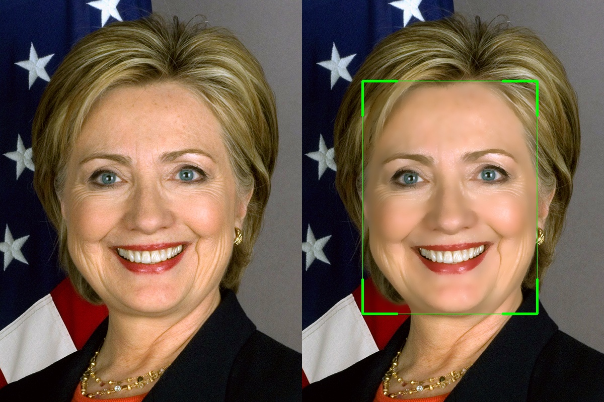

# Face Smoothing using OpenCV

[](https://github.com/yakhyo/face-smoothing)

<video controls autoplay loop src="https://github.com/user-attachments/assets/e5bd912b-d499-4a2b-b663-bec6175a0d72" muted="false" width="100%"></video>

<p align="center">
    
</p>

### Installation

1. Clone the repository:

```bash
git clone https://github.com/yakyo/face-smoothing.git
cd face-smoothing
```

2. Install the required dependencies:

```bash
pip install -r requirements.txt
```

3. Run `detect.py`:

```bash
python detect.py --input 0 (webcam)  --output output.mp4
                         video.mp4
                         image.jpg
```

### Reference

- https://github.com/5starkarma/face-smoothing
